19/07/2020

# Introdução

## Contexto

\[escrever contexto\]

## Objetivo

\[escrever objetivo\]

## Perguntas

1.  Quais os municípios com o maior número de casos confirmados de
    Coronavírus?
2.  Quais os municípios com o maior número de mortos por Coronavírus?
3.  Os municípios com os maiores números de casos confirmados são os
    mesmos com os maiores números de mortos?
4.  Fazer as mesmas análises para Estados e Regiões do Brasil.
5.  Quais os 5 estados e 5 municípios que mais aumentaram o número de
    casos no mês de junho com relação ao maio?
6.  Quais os 5 estados com o menor crescimento de casos no mês de junho
    com relação ao maio?
7.  Quais os 5 estados e 5 municípios que mais aumentaram o número de
    óbitos no mês de junho com relação a maio?
8.  Como foi a evolução dos casos nos estados e nos municípios
    identificados nas questões acima?

# Descrição dos dados

A base original consiste em um dataframe contendo 386665 observações com
17 variáveis. As principais variáveis que nos interessam nessa base são
o municipio, a data, os novos casos confirmados, as novas mortes, o
estado,e o código da cidade. Como a base em suas linhas contem
informações tanto de estados quanto de municipios, esse é um ponto que
precisaremos sanar na arrumação dos dados, que segue abaixo

### Base original

``` r
df <- read.csv("./Dados/caso_full.csv")
kable(head(df))
```

| city       | city\_ibge\_code | date       | epidemiological\_week | estimated\_population\_2019 | is\_last | is\_repeated | last\_available\_confirmed | last\_available\_confirmed\_per\_100k\_inhabitants | last\_available\_date | last\_available\_death\_rate | last\_available\_deaths | order\_for\_place | place\_type | state | new\_confirmed | new\_deaths |
| :--------- | ---------------: | :--------- | --------------------: | --------------------------: | :------- | :----------- | -------------------------: | -------------------------------------------------: | :-------------------- | ---------------------------: | ----------------------: | ----------------: | :---------- | :---- | -------------: | ----------: |
| São Paulo |          3550308 | 2020-02-25 |                     9 |                    12252023 | False    | False        |                          1 |                                            0.00816 | 2020-02-25            |                            0 |                       0 |                 1 | city        | SP    |              1 |           0 |
|            |               35 | 2020-02-25 |                     9 |                    45919049 | False    | False        |                          1 |                                            0.00218 | 2020-02-25            |                            0 |                       0 |                 1 | state       | SP    |              1 |           0 |
| São Paulo |          3550308 | 2020-02-26 |                     9 |                    12252023 | False    | False        |                          1 |                                            0.00816 | 2020-02-26            |                            0 |                       0 |                 2 | city        | SP    |              0 |           0 |
|            |               35 | 2020-02-26 |                     9 |                    45919049 | False    | False        |                          1 |                                            0.00218 | 2020-02-26            |                            0 |                       0 |                 2 | state       | SP    |              0 |           0 |
| São Paulo |          3550308 | 2020-02-27 |                     9 |                    12252023 | False    | False        |                          1 |                                            0.00816 | 2020-02-27            |                            0 |                       0 |                 3 | city        | SP    |              0 |           0 |
|            |               35 | 2020-02-27 |                     9 |                    45919049 | False    | False        |                          1 |                                            0.00218 | 2020-02-27            |                            0 |                       0 |                 3 | state       | SP    |              0 |           0 |

### Organizando os dados

Selecionando apenas as cidades, depois selecionando apenas as colunas de
interesse e mudando o tipo da coluna de codigos do IBGE para alterarmos
os nomes das cidades posteriormente. Por fim adicionamos uma coluna com
os meses, separados das datas, pois é uma informação que usaremos para
responder nossas perguntas.

``` r
df <- df %>% filter(place_type == "city") %>% 
select(c("date",
         "city",
         "new_confirmed",
         "new_deaths",
         "state",
         "estimated_population_2019",
         "epidemiological_week",
         "city_ibge_code")) %>% 
  mutate(city_ibge_code = as.character(city_ibge_code)) %>% 
  mutate(Mes = substring(date,6,7))
```

Trazendo tabela com os códigos do IBGE e nomes certos das cidades

``` r
codes <- read_excel("./Dados/Codigo_IBGE.xls")
```

Trazendo o nome correto para o Dataframe

``` r
dfarrumado <- left_join(df,codes,by = c("city_ibge_code"="Código"))
```

Excluindo a coluna com os nomes mal formatados

``` r
dfarrumado$city <- NULL
```

Arrumando a ordem e o nome das colunas

``` r
df <- dfarrumado[,c(1,8,7,9,4,5,2,3)]
colnames(df) <- c("data","mes","codigo","municipio","estado","popest2019","novoscasos","novasmortes")
df$popest2019 <- NULL
```

### Tabela gerada

Apenas as 6 primeiras linhas

| data       | mes | codigo  | municipio | estado | novoscasos | novasmortes |
| :--------- | :-- | :------ | :-------- | :----- | ---------: | ----------: |
| 2020-02-25 | 02  | 3550308 | São Paulo | SP     |          1 |           0 |
| 2020-02-26 | 02  | 3550308 | São Paulo | SP     |          0 |           0 |
| 2020-02-27 | 02  | 3550308 | São Paulo | SP     |          0 |           0 |
| 2020-02-28 | 02  | 3550308 | São Paulo | SP     |          1 |           0 |
| 2020-02-29 | 02  | 3550308 | São Paulo | SP     |          0 |           0 |
| 2020-03-01 | 03  | 3550308 | São Paulo | SP     |          0 |           0 |

Observando algumas informações do data.frame

    ##      data               mes               codigo           municipio        
    ##  Length:383205      Length:383205      Length:383205      Length:383205     
    ##  Class :character   Class :character   Class :character   Class :character  
    ##  Mode  :character   Mode  :character   Mode  :character   Mode  :character  
    ##                                                                             
    ##                                                                             
    ##                                                                             
    ##     estado            novoscasos         novasmortes      
    ##  Length:383205      Min.   :-1578.000   Min.   :-82.0000  
    ##  Class :character   1st Qu.:    0.000   1st Qu.:  0.0000  
    ##  Mode  :character   Median :    0.000   Median :  0.0000  
    ##                     Mean   :    5.353   Mean   :  0.2033  
    ##                     3rd Qu.:    2.000   3rd Qu.:  0.0000  
    ##                     Max.   : 6877.000   Max.   :227.0000

podemos observar como informações mais interessantes o fato do máximo de
novos casos em um municipio em um dia ter sido 6877 novos casos e o
máximo de mortes em um único municipio em um dia ter sido de 227 óbitos

# Análise Exploratória

### 1\. Quais os municípios com o maior número de casos confirmados de Coronavírus?

Aqui optamos por fazer um simples gráfico de barras com os 10 municipios
com mais casos até 18/07/2020

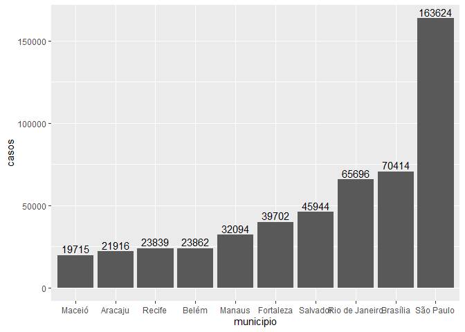<!-- -->

Percebemos que os 10 municipios que tiveram mais casos até o dia 18 de
julho de 2020 foram São Paulo, Brasilia e Rio de Janeiro. destaca-se a
diferença gritante entre o primeiro e segundo lugar, em que são paulo
tem cerca de 132% a mais de casos que Brasilia

### 2\. Quais os municípios com o maior número de mortos por Coronavírus?

Aqui seguimos a mesma linha para responder a pergunta anterior

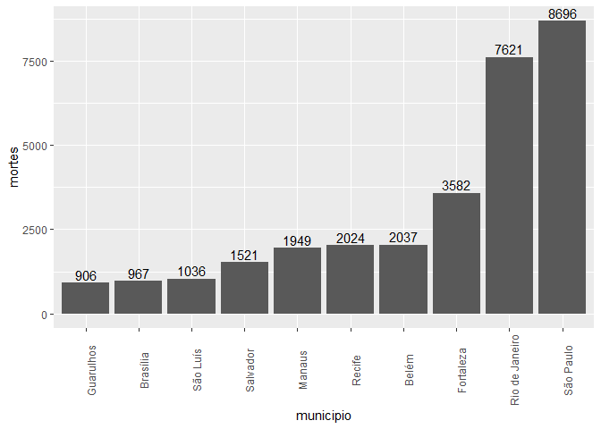<!-- -->

### 3\. Os municípios com os maiores números de casos confirmados são os mesmos com os maiores números de mortos?

Aqui podiamos apenas comparar as duas últimas visualizações, mas optamos
por gerar uma visualização com ambos os gráficos, de modo a facilitar a
comparação.

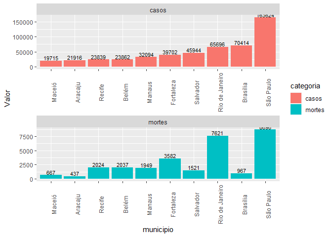<!-- -->

### 4\. Fazer as mesmas análises para Estados do Brasil.

Aqui seguimos a mesma lógica das perguntas anteriores, porém
substituindo municípios por estados. Abaixo gráfico de casos

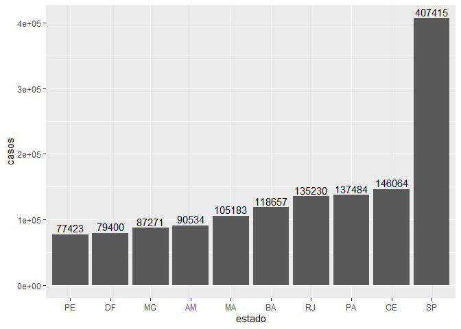<!-- -->

Abaixo gráfico de óbitos:

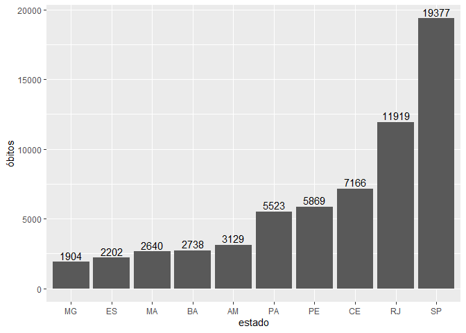<!-- -->

E por fim a comparação:

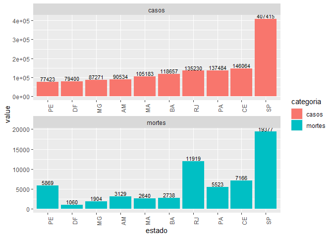<!-- -->

### 5\. Quais os 5 estados e 5 municípios que mais aumentaram o número de casos no mês de junho com relação ao maio?

### 6\. Quais os 5 estados com o menor crescimento de casos no mês de junho com relação ao maio?

Aqui vimos que uma visualização para casos e morte no contexto do
estados já nos permitira identificar aqueles com maior e menor
crescimento. Optamos também por duas estrategias para averiguação da
variação: a variação absoluta e a variação relativa. Abaixo segue o
gráfico do municipios que tiveram o maior crescimento absoluto entre
maio e junho:

    ## Adding missing grouping variables: `estado`, `municipio`

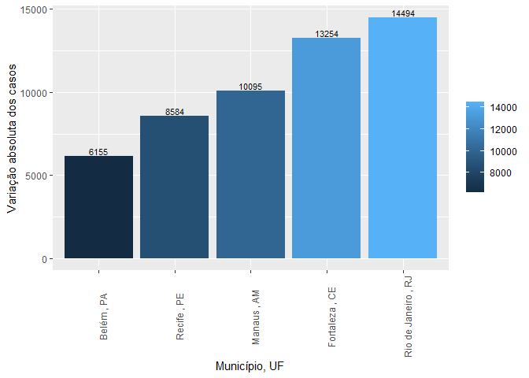<!-- -->

Em seguida, os municipios com maior crescimento relativo. Para gerar
esse gráfico optamos por excluir aqueles municipios que não tinham
nenhum caso em maio.

    ## Adding missing grouping variables: `estado`, `municipio`

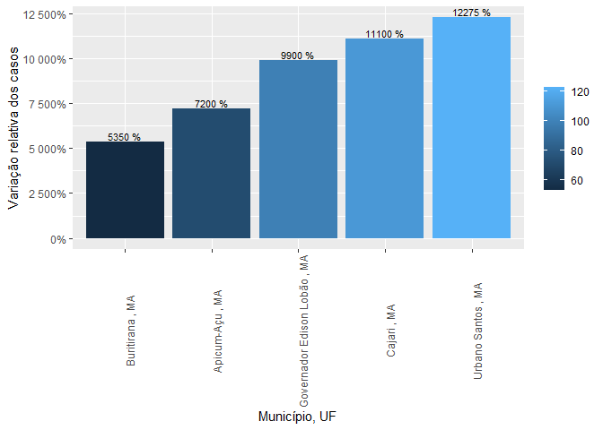<!-- -->

Aqui, verificamos que esses municipios são aqueles que tinham menos de 5
casos em maio e foram para centenas em junho.

Abaixo temos o gráfico com a variação absoluta dos estados:

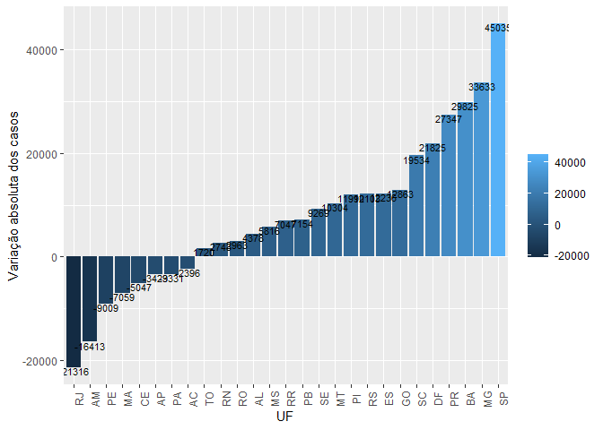<!-- -->

e por fim, a variação relativa dos estados

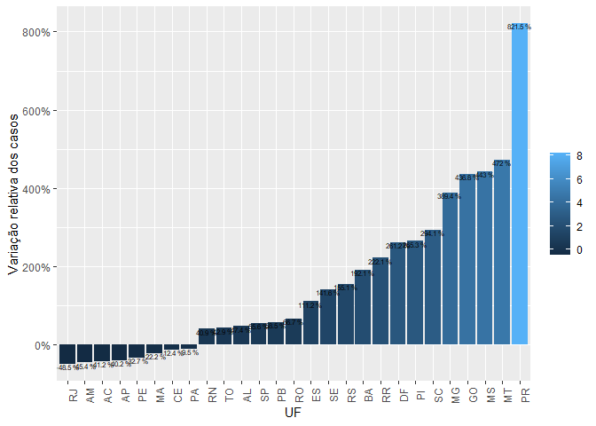<!-- -->

### 7\. Quais os 5 estados e 5 municípios que mais aumentaram o número de óbitos no mês de junho com relação a maio?

Aqui seguimos a mesma lógica da questão anterior, só que averiguando o
número de óbitos. Abaixo temos o gráfico com a variação absoluta de
mortes por munícipio

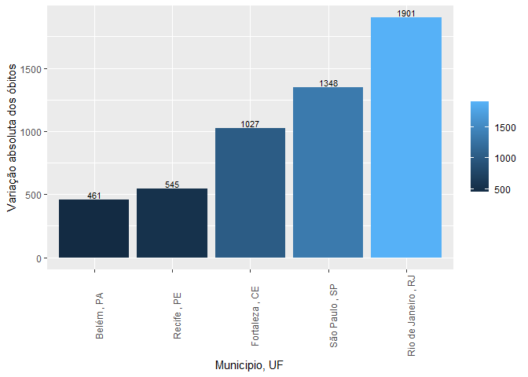<!-- -->

Em seguida observamos a variação relativa:

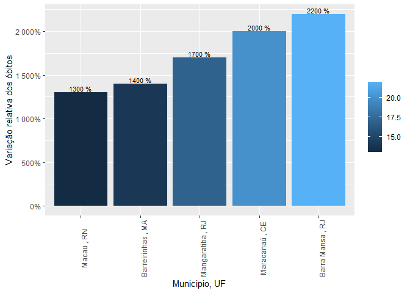<!-- -->

Obtivemos então o gráfico da variação absoluta dos estados:

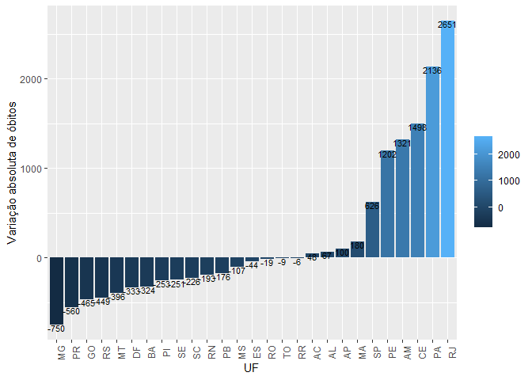<!-- -->

e por fim o de variação relativa:

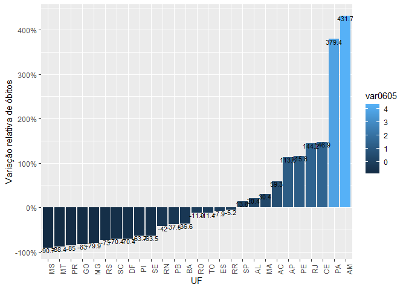<!-- -->

### 8\. Como foi a evolução dos casos nos estados e nos municípios identificados nas questões acima?

Para responder essa pergunta procuramos todos os municipios e estados
que apareçam nas explorações anteriores, de modo que fizessemos apenas
duas visualizações: 1 com o estados que apareceram e outra com os
munícipios. Nelas também colocamos a serie temporal dos óbitos também,
porém adicionando um eixo y secundário para que a variação também seja
possível de ser observada. Essas visualizações podem ser observadas a
seguir:

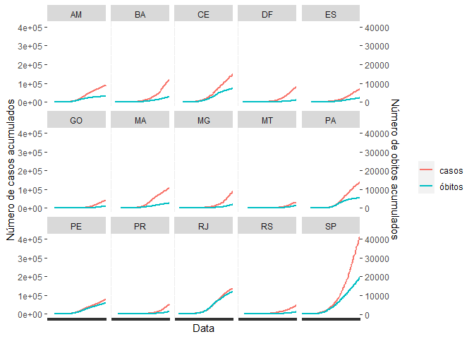<!-- -->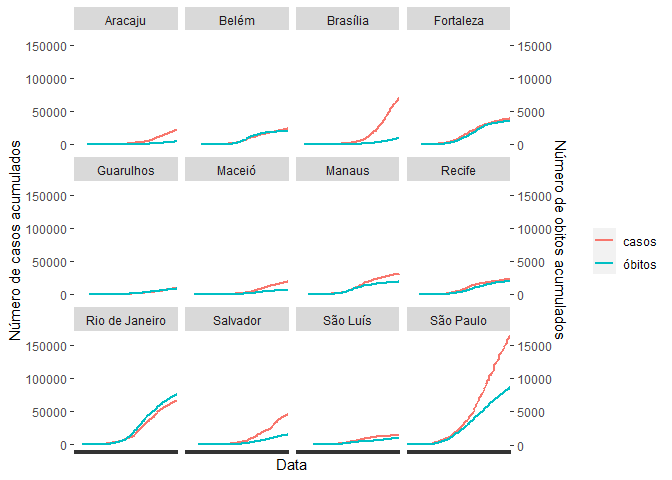<!-- -->

# Limitações e dificuldades operacionais

As principais limitações de nossa análise foi o fato de não
considerarmos a população dos municípios, não calculando coeficientes de
mortalidade para os municipios e estados que analisamos. Pela definição
das perguntas ter sido prévia, e no momento que as definimos não
incluimos análises incluindo as populações, acabamos não inserindo essa
variável na análise. Como os dados estavam um pouco desorganizados, a
fase de arrumação foi bem desafiadora, mas, com os dados arrumados, a
geração das visualizações foi bem tranquila. A utilização dos pipes
trouxe imensa produtividade ao processo.
